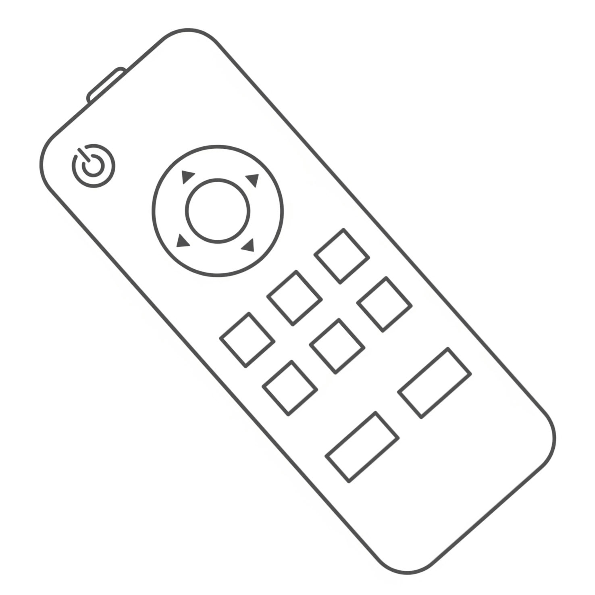

# Leassemblee

Try this out yourself at [https://leassemblee.com](https://leassemblee.com) !



Leassemblee lets you connect a physical robot to a remote controller — entirely in the browser. Plug a robot into a Chromium-based desktop and control it from any other device (phone, tablet, desktop) using a short connection code.

Getting started (pnpm)

1. Install dependencies

```bash
pnpm install
```

2. Start the dev server

```bash
pnpm dev
```

Open the app in a Chromium-based desktop browser to connect a robot. From another device, open the same site and enter the connection code shown on the robot device.

Scripts

- `pnpm dev` — start Next.js dev server
- `pnpm build` — build for production

Notes

- The Web Serial API is only available in Chromium-based browsers (Chrome, Edge) and requires a desktop operating system. The UI will show guidance for users on unsupported browsers.
- Use the `favicon.png` image in `public/` as the project image.

Contributing

Please use `pnpm` for installs and scripts. Pull requests welcome.